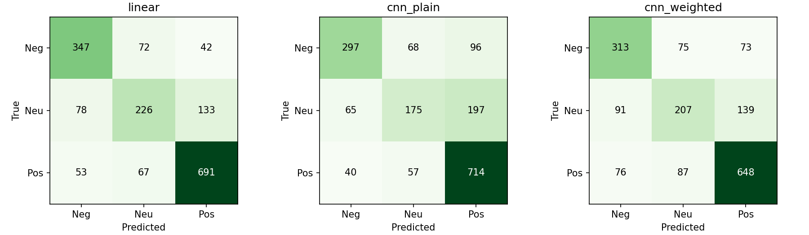
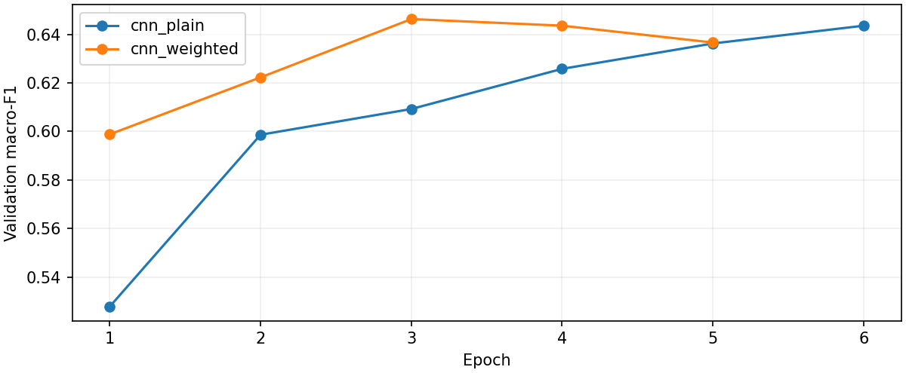

# 金融短文本情绪分类与机器学习模型对照

基于 FinFE 中文金融社交短评，对比 **TF-IDF + 逻辑回归、TextCNN、类别加权 TextCNN**，完成数据清理、验证集选模、测试评估和本地交互分析。

研究问题：在小规模金融文本数据上，轻量神经网络是否比传统模型更有效，类别加权会改变哪些类别的表现？TextCNN 基于开源实现改造，从随机初始化训练，不使用预训练语言模型。

## 实验结果

固定随机种子 42，训练 / 验证 / 测试样本数为 **8,313 / 1,468 / 1,709**。所有模型使用相同划分和最多 128 字的输入。

| 模型 | 验证集 Macro-F1 | 测试准确率 | 测试 Macro-F1 |
|---|---:|---:|---:|
| TF-IDF + 逻辑回归 | **0.6901** | **73.96%** | **0.7089** |
| TextCNN | 0.6436 | 69.40% | 0.6496 |
| 类别加权 TextCNN | 0.6463 | 68.34% | 0.6515 |

传统模型在本轮验证集和测试集上均表现最好。类别加权使 CNN 的测试 Macro-F1 略有提高，但准确率下降，不能据此声称稳定提升。中性类召回率由普通 CNN 的 0.4005 提高至加权后的 0.4737，同时积极类召回率从 0.8804 降至 0.7990。

完整汇总见 [实验报告](docs/RESULTS.md) 和 [机器可读指标](docs/results/report.json)。这些文件来自已完成的实验，不是演示数值。





## 开源基础与项目改动

| 部分 | 来源或实现 |
|---|---|
| TextCNN 基础 | [Chinese-Text-Classification-Pytorch](https://github.com/649453932/Chinese-Text-Classification-Pytorch)，保留原代码与 MIT 许可证 |
| 数据来源 | [BBT-FinCUGE-Applications / FinFE](https://github.com/supersymmetry-technologies/BBT-FinCUGE-Applications/tree/main/FinCUGE_Publish/finfe) |
| 数据处理 | NFKC 规范化、按实际截断输入去重、排除冲突标签、检查划分交集 |
| 网络改造 | 96 维字符向量、64 个卷积通道、补齐窗口掩码、仅训练集构建词表 |
| 实验设计 | TF-IDF + LR 基线；普通与类别加权损失对照；验证集选择 C 和训练轮次 |
| 结果分析 | 每类指标、混淆矩阵、学习曲线、否定词切片、逐条误判与 CSV 导出 |
| 本地页面 | 三模型预测比较、指标查看、误判筛选；CPU 推理 |

TextCNN 共 271,299 个参数。首轮全流程训练约 651 秒，设备为 RTX 5060 Laptop GPU；这是一次实测耗时，不保证其他设备耗时相同。来源版本及文件校验值见 [sources.json](docs/results/sources.json)。

## 安装与运行

建议使用 Python 3.10 或 3.11 的独立环境。仓库不包含数据和模型权重，首次使用需先下载数据并训练；仅阅读结果不需要安装依赖。

下载仓库 ZIP 并解压，或通过 Git 克隆。进入含 `run.py` 的项目根目录，创建环境：

```bash
python -m venv .venv
```

激活环境：Windows PowerShell 使用 `.\.venv\Scripts\Activate.ps1`，macOS / Linux 使用 `source .venv/bin/activate`。以下命令均在激活后的环境中运行。

CPU 环境安装：

```bash
python -m pip install --upgrade pip
python -m pip install torch --index-url https://download.pytorch.org/whl/cpu
python -m pip install -r requirements.txt
```

GPU 环境请先按照 [PyTorch 官方安装页](https://pytorch.org/get-started/locally/) 安装匹配显卡与驱动的 PyTorch，再安装 `requirements.txt`。RTX 5060 需要支持 `sm_120` 的构建；首轮使用 PyTorch 2.11.0+cu128。关键依赖的实测版本记录于 [environment.json](docs/results/environment.json)，它是环境记录，不是跨平台锁定文件。

```bash
# 下载固定版本数据、去重、划分
python -u -X utf8 run.py prepare

# GPU 训练；无兼容 GPU 时改为 --device cpu，耗时可能更长
python -u -X utf8 run.py train --epochs 6 --device cuda

# 验证关键逻辑及实验产物
python -X utf8 -m unittest discover -s tests -v
python -X utf8 check_artifacts.py

# 启动本地交互页面
python -u -X utf8 run.py serve --port 8787
```

浏览器打开 <http://127.0.0.1:8787>，终端 `Ctrl+C` 停止。Windows 也可在已激活的环境下运行 `start_lab.cmd`，或在项目内创建 `.venv` 后双击它。

下载和训练日志同时保留在终端及 `logs/prepare.log`、`logs/train.log`。成功结束应出现 `PROCESS_EXIT_CODE=0`。不要同时启动两次训练，也不要在训练覆盖权重时运行页面。

后台启动及接口检查可用 `python start_server.py`、`python -X utf8 tests/smoke_http.py`；后台服务的 PID 与地址记录在 `.runtime.json`，日志位于 `logs/server_*.log`。这组接口检查需要已经训练出的模型。

## 数据与评估协议

1. 下载 Git blob 固定版本的原始训练集 16,157 条、评估集 2,020 条，核验 blob 哈希并记录 SHA-256。
2. 所有输入先规范化并截断至 128 字，再按实际模型输入分组。排除 1,010 个标签冲突组，共 2,038 行；另外移除 4,649 个重复行。
3. 同一无冲突输入若同时出现在两个来源，优先保留在评估侧，从训练池移除。训练池按类别分层划分 85% 训练、15% 验证，评估侧作为测试集。
4. TF-IDF 和字符词表仅拟合训练数据。逻辑回归 C 与 CNN 最佳轮次按验证集 Macro-F1 选择，选模完成后报告测试结果。

**这是自定义清理子集，不是官方榜单协议。** 冲突清理使用了全部已发布标签，包括原始评估集标签，因此改变了测试总体，指标只适用于清理后的无冲突样本，不能等同于对未知原始分布的无偏估计。划分之间不存在相同模型输入，并不消除这一局限。

其他边界：

- 数据是金融社交评论，没有独立标题 / 正文字段，也没有可用于时间切分的可靠时间戳；尚未验证财经新闻、公告或收益预测效果。
- 只有一个随机种子，尚未开展多次运行的显著性检验；否定词切片仅作诊断分析。
- 模型分数未经概率校准，页面的 0.60 复核阈值不代表已验证的置信度。
- 原始数据未发现明确的独立数据许可证，仓库和 ZIP 均不分发原始文本、清理后文本、逐条误判、词表或模型文件。需要运行时从上游获取并自行确认适用条件。
- 服务仅绑定 `127.0.0.1`，用于本地研究。只加载本项目在可信环境生成的权重与 joblib 文件。

## 代码导航

```text
run.py                 命令入口
common.py              输入规范化、路径、日志
prepare.py             固定来源下载、清理、划分
model.py               训练集词表、轻量 TextCNN
experiment.py          模型训练、验证选择、测试报告
web.py / static/       本地推理接口与页面
tests/                 输入、划分、补齐与接口检查
check_artifacts.py     从逐条预测重算指标，核验数据哈希
docs/                  公开实验汇总、图表和来源记录
third_party/           上游原代码及许可证
data/                  本地数据，不提交
artifacts/             本地权重、误判、图表，不提交
logs/                  本地日志，不提交
```

阅读顺序建议为 `common.py -> prepare.py -> model.py -> experiment.py`。本项目里值得复用的原则是：**先按实际模型输入去重，再划分并只在训练集拟合预处理。** 同样的约束也适用于量化研究中的标准化与缺失值填补。相关回归检查位于 `tests/test_contracts.py`。

## 许可证

本项目新增代码采用 [MIT License](LICENSE)。TextCNN 上游版权与许可保留在 [LICENSE.TextCNN](third_party/LICENSE.TextCNN)；页面图标来自 Lucide 0.468.0，许可见 [LICENSE.Lucide](third_party/LICENSE.Lucide)。具体来源及分发范围见 [THIRD_PARTY_NOTICES.md](THIRD_PARTY_NOTICES.md)。代码许可证不覆盖上游数据。
